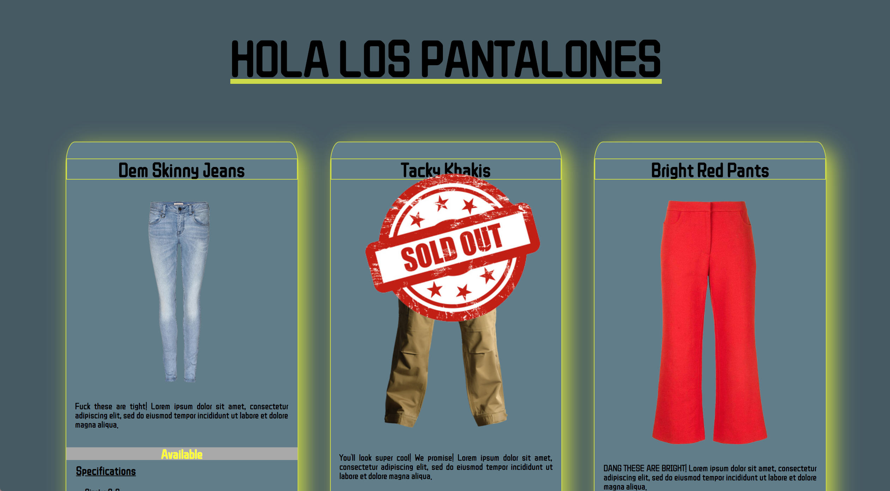

# Exercise 1: "Product Cards"

### Description:
A collection of product cards
### Technologies Used:
* HTML
* CSS
* JavaScript
* Flexbox

### Screenshots: 
Here is the Home Page:

### How to run: 
1. Go to: `https://www.npmjs.com/package/http-server` and install "http-server".  
2. Navigate to the project folder in command line interface and type: `http-server -p 8080`  
3. This will show at: `http://localhost:8080` in your internet browser.